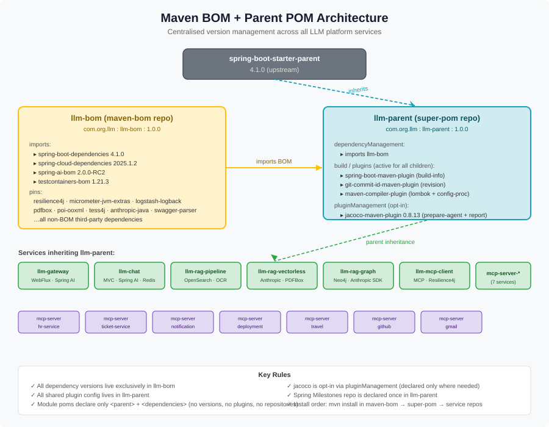

# LLM Platform — Parent POM (`llm-parent`)

This repository contains the **corporate parent POM** for all LLM platform services. It sits at the top of every service's inheritance chain and provides:

- A single import of [`llm-bom`](../maven-bom) so all dependency versions are resolved centrally.
- Pre-configured shared plugins active for every child module.
- The Spring Milestones repository declaration (no per-module repetition).

## Architecture



### Three-tier structure

```
spring-boot-starter-parent (4.1.0)
        │  inherits
        ▼
  llm-parent  ◄──── imports ──── llm-bom
  (this repo)                   (maven-bom repo)
        │  parent
        ├──── llm-gateway
        ├──── llm-chat
        ├──── llm-rag-pipeline
        ├──── llm-rag-vectorless
        ├──── llm-rag-graph
        ├──── llm-mcp-client
        ├──── mcp-server-hr-service
        ├──── mcp-server-ticket-service
        ├──── mcp-server-notification-service
        ├──── mcp-server-deployment-service
        ├──── mcp-server-travel-service
        ├──── mcp-server-github-service
        └──── mcp-server-gmail-service
```

### What lives where

| Concern | Where |
|---|---|
| All dependency versions | `llm-bom` → `<dependencyManagement>` |
| Platform BOM imports (Spring Cloud, Spring AI, Testcontainers) | `llm-bom` → `<dependencyManagement>` |
| `java.version` property | `llm-parent` → `<properties>` |
| `spring-boot-maven-plugin` (build-info) | `llm-parent` → `<build><plugins>` |
| `git-commit-id-maven-plugin` | `llm-parent` → `<build><plugins>` |
| `maven-compiler-plugin` (Lombok + config-processor) | `llm-parent` → `<build><plugins>` |
| `jacoco-maven-plugin` (opt-in via pluginManagement) | `llm-parent` → `<build><pluginManagement>` |
| Spring Milestones repository | `llm-parent` → `<repositories>` |
| Module-specific dependencies | each service `pom.xml` → `<dependencies>` |

## Rules for child module POMs

Each service pom must:

1. **Declare `llm-parent` as parent** (no `<relativePath>` — resolved from local/remote repo):
   ```xml
   <parent>
       <groupId>com.org.llm</groupId>
       <artifactId>llm-parent</artifactId>
       <version>1.0.0</version>
       <relativePath/>
   </parent>
   ```

2. **List only `<dependencies>` — no `<version>` tags** (all versions managed by the BOM).

3. **No `<dependencyManagement>`**, **no `<repositories>`**, **no plugin declarations** (unless opting into jacoco or adding a module-specific check execution).

4. To enable JaCoCo coverage, add only:
   ```xml
   <build>
       <plugins>
           <plugin>
               <groupId>org.jacoco</groupId>
               <artifactId>jacoco-maven-plugin</artifactId>
               <!-- prepare-agent + report come from pluginManagement -->
               <!-- optionally add a <check> execution here -->
           </plugin>
       </plugins>
   </build>
   ```

## Build order

These two POMs must be installed to the local Maven repo before building any service:

```bash
# 1. Install the BOM first
cd ../maven-bom && mvn install

# 2. Install the parent
cd ../super-pom && mvn install

# 3. Build any service
cd ../LLM/llm-chat && mvn package
```

## Coordinates

| Artifact | GroupId | ArtifactId | Version |
|---|---|---|---|
| BOM | `com.org.llm` | `llm-bom` | `1.0.0` |
| Parent | `com.org.llm` | `llm-parent` | `1.0.0` |
