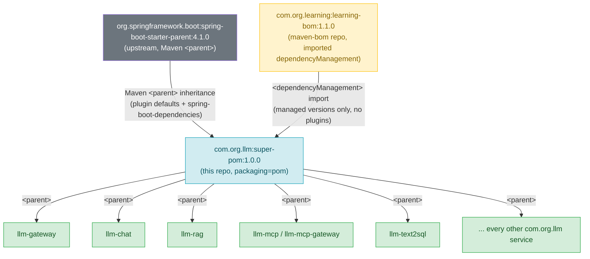
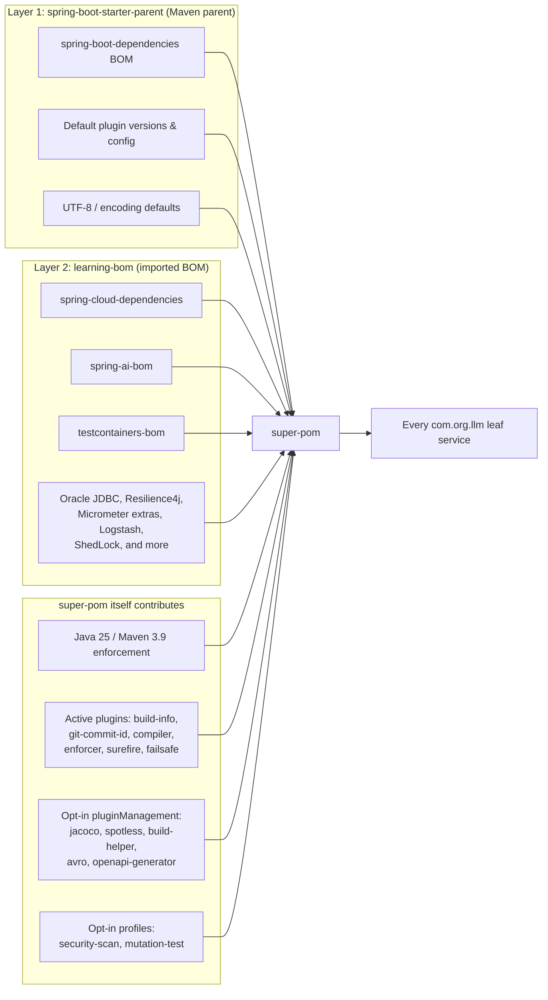

# super-pom — Corporate Parent POM for `com.org.llm` Services

## Table of contents

- [Purpose and scope](#purpose-and-scope)
- [Why a shared parent POM at all](#why-a-shared-parent-pom-at-all)
- [The two-layer dependency management model](#the-two-layer-dependency-management-model)
- [Architecture diagram](#architecture-diagram)
- [Inheritance chain](#inheritance-chain)
- [Coordinates and versioning](#coordinates-and-versioning)
- [Properties](#properties)
- [Repositories and plugin repositories](#repositories-and-plugin-repositories)
- [Active plugins (wired for every child, no opt-in required)](#active-plugins-wired-for-every-child-no-opt-in-required)
- [pluginManagement (opt-in plugins)](#pluginmanagement-opt-in-plugins)
- [Profiles](#profiles)
- [Enforcer rules in detail](#enforcer-rules-in-detail)
- [How a leaf repo consumes this POM](#how-a-leaf-repo-consumes-this-pom)
- [Build and install order](#build-and-install-order)
- [Suppressing an OWASP false positive](#suppressing-an-owasp-false-positive)
- [Versioning and upgrade policy](#versioning-and-upgrade-policy)
- [Known gaps / staleness notes](#known-gaps--staleness-notes)

## Purpose and scope

`super-pom` is the top-level Maven `<parent>` for every service in the `com.org.llm`
platform (gateway, chat, RAG pipelines, MCP clients/servers, and the
`llm-text2sql` service, among others). It is deliberately **not** a code
library — it produces no jar, ships no classes, and is declared with
`<packaging>pom</packaging>`. Its only job is to be inherited from, so that
build configuration which would otherwise be copy-pasted into a dozen
`pom.xml` files instead lives in exactly one place.

Concretely, this repository is responsible for three things, and only three
things:

1. **Toolchain enforcement** — pinning the Java and Maven versions every
   service must build with, and failing fast if they don't match.
2. **Shared build/plugin configuration** — wiring the Spring Boot plugin,
   git-commit metadata, annotation processing, test execution flags, and
   opt-in quality-gate plugins (JaCoCo, Spotless, OWASP, PIT) so that no
   child module has to configure them itself.
3. **A second layer of dependency-version management** on top of Spring
   Boot's own, by importing this organization's `learning-bom`.

It does **not** own application dependency versions directly (those live in
`learning-bom`, a separate repository — see below), and it does not contain
any application source code.

## Why a shared parent POM at all

In a multi-repo organization with many Spring Boot services, three problems
recur constantly if each service manages its own build:

- **Version drift.** Repo A upgrades to Spring Boot 4.1.0 and Java 25; repo B
  is still on Boot 3.3 and Java 17. Nothing enforces consistency, and CI in
  one repo can pass while a nearly-identical repo silently uses a different,
  possibly vulnerable, dependency graph.
- **Copy-pasted plugin configuration.** Things like "enable Lombok annotation
  processing," "generate `git.properties` for `/actuator/info`," or "fail the
  build on Java < 21" end up hand-copied into every `pom.xml`. When the
  organization decides to change one of these policies (e.g. bump the
  required Java baseline, or add a new mandatory plugin), someone has to
  remember to edit N repositories instead of one.
- **Inconsistent quality gates.** Whether a repo runs dependency vulnerability
  scanning, mutation testing, or code coverage becomes a per-repo decision
  made by whoever set up that repo, rather than an organizational default.

A shared parent POM solves all three by giving every service a single common
ancestor. Bumping the Spring Boot version, adding a new enforcer rule, or
introducing a new mandatory plugin becomes a one-line change in `super-pom`
followed by a version bump — every service that declares
`<parent><artifactId>super-pom</artifactId></parent>` picks up the change the
next time it resolves its parent, with **zero changes to its own `pom.xml`**.

This is the standard "corporate/organizational parent POM" pattern used
across most non-trivial Spring Boot shops, sitting one level *below* Spring's
own `spring-boot-starter-parent` and one level *above* individual services.

## The two-layer dependency management model

This is the single most important architectural fact about this repository,
and it is easy to miss on a first read of the POM: **`super-pom` has two
distinct sources of dependency version management, stacked on top of each
other, each doing a different job.**

### Layer 1 — `spring-boot-starter-parent` (the Maven `<parent>`)

```xml
<parent>
    <groupId>org.springframework.boot</groupId>
    <artifactId>spring-boot-starter-parent</artifactId>
    <version>4.1.0</version>
    <relativePath/>
</parent>
```

`super-pom` inherits directly from Spring's own starter parent. This single
line is what gives every downstream service, transitively:

- The full `spring-boot-dependencies` BOM (hundreds of managed dependency
  versions for anything with a `spring-boot-starter-*` artifact, plus common
  third-party libraries Spring itself depends on or commonly pairs with).
- Spring's default plugin configuration (resource filtering, the default
  `maven-compiler-plugin` release version prior to our override, default
  `maven-surefire-plugin`/`maven-failsafe-plugin` versions, etc.).
- Spring's default `<properties>` for overriding individual dependency
  versions (e.g. `<lombok.version>`) if ever needed.
- UTF-8 source/reporting encoding and other baseline sane defaults.

Because this is a Maven **`<parent>`** relationship (not an import), it also
means `super-pom` and everything beneath it participates in Spring Boot's
plugin defaults, not just its dependency versions.

### Layer 2 — `learning-bom` (an imported BOM in `<dependencyManagement>`)

```xml
<dependencyManagement>
    <dependencies>
        <dependency>
            <groupId>com.org.learning</groupId>
            <artifactId>learning-bom</artifactId>
            <version>${learning-bom.version}</version>
            <type>pom</type>
            <scope>import</scope>
        </dependency>
    </dependencies>
</dependencyManagement>
```

`learning-bom` lives in a separate repository (`maven-bom`, artifact
`com.org.learning:learning-bom`, currently pinned here at `1.1.0`) and is
**imported**, not inherited. An imported BOM only contributes managed
dependency *versions* — it contributes no plugin configuration, no
properties beyond what Maven's import mechanics expose, and no parent-child
relationship. `super-pom` chooses to bring it in via
`<dependencyManagement>` so that every version it manages is available to
every child module without that module writing an explicit `<version>` tag.

Reading `learning-bom`'s own `pom.xml`, its `<dependencyManagement>` imports:

- `spring-boot-dependencies` (yes — a second, explicit import of the same
  BOM Layer 1 already provides transitively via parent inheritance; Maven's
  "nearest declaration wins" / first-imported-wins rule means this is safe
  and is primarily there so `learning-bom` remains usable standalone by
  non-Boot-parented consumers)
- `spring-cloud-dependencies`
- `spring-ai-bom`
- `testcontainers-bom`
- A long tail of individually pinned third-party libraries not covered by
  any of the above BOMs: Oracle JDBC (`ojdbc17`), Resilience4j modules,
  `micrometer-jvm-extras`, Micrometer context-propagation, Logstash's
  structured-logging encoder, ShedLock (distributed scheduling), and more.

**Why two layers instead of one?** Spring's BOM covers "the Spring
ecosystem." It has no opinion about Oracle's JDBC driver version, this
org's pinned Resilience4j version, or which build of `testcontainers-bom`
every service should use for integration tests. `learning-bom` is where the
organization's own opinions about *non-Spring, cross-cutting* dependency
versions live — and critically, it is versioned and released
**independently** of `super-pom`. A team can bump `learning-bom` to pick up
a new Testcontainers release without touching plugin configuration, and can
bump `super-pom` to change enforcer rules without touching a single managed
dependency version. Two axes of change, two release cadences, one import
statement gluing them together.

### Net effect for a leaf service

A service's own `pom.xml` sees a dependency version resolution order of
roughly: its own explicit `<version>` (if any, discouraged) → `learning-bom`
imports → `spring-boot-starter-parent`'s own `spring-boot-dependencies`
import. In practice this means a leaf repo like `llm-text2sql` can declare

```xml
<dependency>
    <groupId>org.springframework.ai</groupId>
    <artifactId>spring-ai-starter-model-anthropic</artifactId>
</dependency>
```

with **no version tag at all**, and the correct, organization-approved
version resolves automatically.

## Architecture diagram

`design.svg` (embedded below) is the existing hand-drawn architecture
diagram for this repository. It is **partially stale** relative to the
current `pom.xml` — see [Known gaps / staleness notes](#known-gaps--staleness-notes)
for the specifics — but its central shape (Spring Boot parent above,
this repo's parent POM to the right importing a BOM from the left, leaf
services hanging off the bottom) is still the correct mental model and is
reproduced below for a quick visual reference:


Because the SVG's labels have drifted from the real coordinates (`llm-bom`
vs. the real `learning-bom`, `llm-parent` vs. the real `super-pom`, and a
`jacoco-maven-plugin` version that no longer matches), the Mermaid diagrams
below describe the **current, actual** state of this `pom.xml` and should be
treated as the source of truth until `design.svg` is redrawn.

### Inheritance chain



### What flows through which mechanism



## Coordinates and versioning

| Field | Value |
|---|---|
| `groupId` | `com.org.llm` |
| `artifactId` | `super-pom` |
| `version` | `1.0.0` |
| `packaging` | `pom` |
| `name` | `LLM :: Parent` |

Because `packaging` is `pom`, Maven never expects source code in this
repository and never produces a jar — only a `pom.xml` is installed to the
local/remote repository. Every downstream service references this exact
`groupId:artifactId:version` triple in its own `<parent>` block.

## Properties

| Property | Value | Purpose |
|---|---|---|
| `java.version` | `25` | Baseline Java language/runtime version for every child module. |
| `maven.compiler.release` | `${java.version}` (25) | Passed to `javac --release`; guarantees bytecode + API compatibility with Java 25, not just source compatibility. |
| `avro-maven-plugin.version` | `1.12.0` | Version pin for the opt-in Avro schema-to-Java code generator. |
| `build-helper-maven-plugin.version` | `3.6.0` | Version pin for the opt-in extra-source-directory helper plugin. |
| `spotless-maven-plugin.version` | `2.46.1` | Version pin for the opt-in code formatter. |
| `openapi-generator-maven-plugin.version` | `7.16.0` | Version pin for the opt-in OpenAPI client/server stub generator. |
| `dependency-check-maven.version` | `12.1.0` | Version pin for the OWASP CVE scanner used by the `security-scan` profile. |
| `pitest-maven.version` | `1.19.1` | Version pin for the PIT mutation-testing engine used by the `mutation-test` profile. |
| `pitest-junit5-plugin.version` | `1.2.3` | JUnit 5 integration shim required for PIT to discover JUnit 5 tests. |
| `learning-bom.version` | `1.1.0` | Pinned version of the imported organizational BOM (see the two-layer model above). |

Centralizing these as properties (rather than hard-coding version strings
inline on each plugin) means a single-line change here updates the version
everywhere the property is referenced, and makes `mvn versions:*` tooling
able to detect and bump them mechanically.

## Repositories and plugin repositories

```xml
<repositories>
    <repository><id>spring-milestones</id> ... </repository>
    <repository><id>confluent</id> ... </repository>
</repositories>
<pluginRepositories>
    <pluginRepository><id>spring-milestones</id> ... </pluginRepository>
</pluginRepositories>
```

- **`spring-milestones`** (`https://repo.spring.io/milestone`, snapshots
  disabled) — required because this POM pins Spring Boot `4.1.0` and
  related Spring ecosystem artifacts that may, at any point in time, be
  pre-GA milestone or RC builds not yet published to Maven Central. Declared
  as both a `<repository>` (for dependency resolution) and a
  `<pluginRepository>` (in case a Spring plugin itself is only available as
  a milestone build).
- **`confluent`** (`https://packages.confluent.io/maven/`) — Confluent's
  Maven repository, needed by any service that pulls in Kafka Avro/Schema
  Registry client artifacts that are not mirrored to Central. Declared once
  here so no individual Kafka-consuming service has to repeat it.

Declaring these once, in the parent, means every child module resolves
against the same repository set with no per-repo configuration — an
important consistency guarantee, since a missing repository declaration in
one service but not another is a classic source of "works on my machine but
not in CI" build failures.

## Active plugins (wired for every child, no opt-in required)

These plugins live in `<build><plugins>` (as opposed to
`<pluginManagement>`), which means Maven activates them for **every single
child module automatically** — a child never has to redeclare them to get
their behavior.

### `spring-boot-maven-plugin`

```xml
<plugin>
    <groupId>org.springframework.boot</groupId>
    <artifactId>spring-boot-maven-plugin</artifactId>
    <executions>
        <execution>
            <goals><goal>build-info</goal></goals>
        </execution>
    </executions>
    <configuration>
        <excludes>
            <exclude>
                <groupId>org.projectlombok</groupId>
                <artifactId>lombok</artifactId>
            </exclude>
        </excludes>
    </configuration>
</plugin>
```

Two things happen here:

- The `build-info` goal generates `META-INF/build-info.properties` at build
  time — group, artifact, name, version, and build timestamp. Spring Boot
  Actuator's `/actuator/info` endpoint reads this file automatically and
  exposes it as JSON, so **every service gets a working `build.*` block in
  `/actuator/info` for free**, with no code and no per-service
  configuration. This is a basic but critical piece of build provenance:
  when triaging an incident, "what version of this service is actually
  running in this pod" becomes one HTTP call.
- The `excludes` block ensures Lombok is not repackaged into the final
  executable fat jar produced by `spring-boot:repackage` — Lombok is a
  compile-time-only annotation processor and has no business being a
  runtime dependency of the shipped artifact; shipping it would bloat the
  jar and could theoretically expose annotation-processing classes at
  runtime for no benefit.

### `git-commit-id-maven-plugin`

```xml
<plugin>
    <groupId>io.github.git-commit-id</groupId>
    <artifactId>git-commit-id-maven-plugin</artifactId>
    <executions>
        <execution>
            <id>get-the-git-infos</id>
            <goals><goal>revision</goal></goals>
            <phase>initialize</phase>
        </execution>
    </executions>
    <configuration>
        <generateGitPropertiesFile>true</generateGitPropertiesFile>
        <generateGitPropertiesFilename>${project.build.outputDirectory}/git.properties</generateGitPropertiesFilename>
        <commitIdGenerationMode>full</commitIdGenerationMode>
    </configuration>
</plugin>
```

Runs the `revision` goal in the `initialize` phase (i.e. very early in the
build) and writes a `git.properties` file into
`target/classes/git.properties`. Like `build-info.properties` above, Spring
Boot Actuator's info contributor auto-detects this file and merges its
contents — full commit hash (`commitIdGenerationMode=full`, not the
abbreviated 7-character form), branch, committer date, and dirty-worktree
flag — into `/actuator/info`.

**Why this matters organizationally:** together with `build-info`, this is
what makes "which exact commit is running in production right now"
answerable without SSH-ing into a pod or trusting a deployment tool's own
bookkeeping. It is the kind of low-effort, high-value traceability plugin
that is easy to forget to add per-repo and easy to standardize once,
centrally.

### `maven-compiler-plugin`

```xml
<plugin>
    <groupId>org.apache.maven.plugins</groupId>
    <artifactId>maven-compiler-plugin</artifactId>
    <configuration>
        <annotationProcessorPaths>
            <path>
                <groupId>org.projectlombok</groupId>
                <artifactId>lombok</artifactId>
            </path>
            <path>
                <groupId>org.springframework.boot</groupId>
                <artifactId>spring-boot-configuration-processor</artifactId>
            </path>
        </annotationProcessorPaths>
    </configuration>
</plugin>
```

Explicitly wires two annotation processors onto the compiler's processor
path:

- **Lombok** — so `@Getter`, `@Builder`, `@Slf4j`, etc. work in every child
  module without that module adding its own `annotationProcessorPaths`
  block (a notoriously fiddly piece of Maven configuration to get right,
  especially in combination with a second processor).
- **`spring-boot-configuration-processor`** — generates
  `META-INF/spring-configuration-metadata.json` from `@ConfigurationProperties`
  classes, which is what gives IDEs (and `application.yaml`/`.properties`
  editors) autocomplete and inline documentation for custom configuration
  properties. Centralizing this means any service that defines
  `@ConfigurationProperties` gets IDE support automatically, with no
  per-service compiler configuration.

Note: version and general compiler behavior (source/target/release) are
inherited from `spring-boot-starter-parent` combined with the
`maven.compiler.release=${java.version}` property above — only the
annotation processor wiring is overridden here.

### `maven-enforcer-plugin`

```xml
<plugin>
    <groupId>org.apache.maven.plugins</groupId>
    <artifactId>maven-enforcer-plugin</artifactId>
    <executions>
        <execution>
            <id>enforce-build-environment</id>
            <phase>validate</phase>
            <goals><goal>enforce</goal></goals>
            <configuration>
                <rules>
                    <requireJavaVersion>
                        <version>[21,)</version>
                        <message>Java 21 or higher is required.</message>
                    </requireJavaVersion>
                    <requireMavenVersion>
                        <version>[3.9,)</version>
                        <message>Maven 3.9 or higher is required.</message>
                    </requireMavenVersion>
                    <banDuplicatePomDependencyVersions/>
                </rules>
            </configuration>
        </execution>
    </executions>
</plugin>
```

Runs in the `validate` phase — the very first phase of the Maven lifecycle —
so a misconfigured build environment is rejected before a single line of
code is compiled, rather than surfacing as a confusing downstream failure
(a bytecode version mismatch error from the compiler, or a plugin that
silently no-ops on an unsupported toolchain).

Three rules are active:

- **`requireJavaVersion [21,)`** — build JDK must be Java 21 or newer (an
  open-ended range; any future JDK satisfies it too). Note this is a
  *floor*, and is deliberately looser than the `java.version=25` property
  used for compilation — the enforcer rule guards the minimum JDK the
  *build tool itself* can run under, while `maven.compiler.release`
  controls what bytecode/API level is actually targeted.
- **`requireMavenVersion [3.9,)`** — every developer and CI runner uses
  Maven 3.9 or newer, so build semantics (dependency resolution behavior,
  reproducible builds support, etc.) are consistent across machines.
- **`banDuplicatePomDependencyVersions`** — fails the build if the same
  `groupId:artifactId` appears more than once in a single `<dependencies>`
  block with different versions declared — a classic copy-paste mistake
  that would otherwise silently resolve to whichever declaration Maven
  happens to pick, shipping the wrong jar with no warning.

Centralizing enforcer rules here means the whole organization's minimum
toolchain requirements are defined in one place and can be raised (e.g. from
Java 21 to Java 25 as a hard floor) by editing one file, instantly affecting
every service the next time it builds.

### `maven-surefire-plugin` and `maven-failsafe-plugin` — the Java 25 `--add-opens` flag

```xml
<plugin>
    <groupId>org.apache.maven.plugins</groupId>
    <artifactId>maven-surefire-plugin</artifactId>
    <configuration>
        <argLine>--add-opens java.base/java.lang=ALL-UNNAMED</argLine>
    </configuration>
</plugin>
<plugin>
    <groupId>org.apache.maven.plugins</groupId>
    <artifactId>maven-failsafe-plugin</artifactId>
    <executions>
        <execution>
            <goals><goal>integration-test</goal><goal>verify</goal></goals>
        </execution>
    </executions>
    <configuration>
        <argLine>--add-opens java.base/java.lang=ALL-UNNAMED</argLine>
    </configuration>
</plugin>
```

Both the unit-test runner (Surefire) and the integration-test runner
(Failsafe, wired here with the standard `integration-test` + `verify` goal
pair so `mvn verify` actually runs and checks failsafe-bound tests) pass an
identical JVM argument: `--add-opens java.base/java.lang=ALL-UNNAMED`.

**Why this is needed on newer JDKs:** since the Java Platform Module System
(JPMS) was introduced, the JDK's own internal packages (like
`java.base/java.lang`) are encapsulated by default — reflective access from
outside the module (i.e. from "unnamed module" code, which is what
ordinary classpath-based application and test code runs as) is blocked
unless explicitly opened. As the JDK continues tightening these defaults
release over release, libraries that do deep reflection — mocking
frameworks (Mockito's inline mock maker), certain serialization libraries,
and test frameworks that reflectively manipulate `final` fields or
constructors on JDK-internal classes — increasingly need `java.lang`
specifically opened to run under a modern JDK (this repo's baseline is
Java 25, per `java.version`). Without this flag, tests that previously
worked can start failing with `InaccessibleObjectException` purely because
of a JDK upgrade, with no code change on the team's part. Centralizing the
flag here means no service has to rediscover this the hard way after
bumping its JDK — it is already handled for both unit and integration test
execution.

## pluginManagement (opt-in plugins)

Everything in `<build><pluginManagement>` provides a **version pin and
default configuration**, but does **not** activate the plugin for any
child module. A child module must explicitly redeclare the plugin
(typically with no version, since it's inherited from here) in its own
`<build><plugins>` to opt in. This is the standard Maven pattern for "make
available centrally, but let each module decide if it needs it" — as
opposed to the plugins in the previous section, which run unconditionally
everywhere.

| Plugin | Version | What it does | Notable pre-wired config |
|---|---|---|---|
| `build-helper-maven-plugin` | `3.6.0` | Adds extra source/test-source directories to the build (e.g. generated-sources folders not on the default path). | None beyond version pin. |
| `avro-maven-plugin` | `1.12.0` | Compiles Avro `.avsc`/`.avdl` schema files into generated Java POJOs at build time. | None beyond version pin. |
| `jacoco-maven-plugin` | `0.8.15` | Instruments tests to produce code-coverage data and an HTML/XML coverage report. | Two executions pre-wired: `prepare-agent` (attaches the coverage agent to the test JVM) and a `report` execution bound to the `verify` phase. A child module only has to declare the bare `<plugin>` element with matching `groupId`/`artifactId` — the executions are inherited. |
| `spotless-maven-plugin` | `2.46.1` | Enforces and auto-applies consistent code formatting (imports, whitespace, etc.), typically wired to fail the build (`spotless:check`) or fix it (`spotless:apply`). | None beyond version pin — per-module formatter rules (e.g. which formatter/style) are left to the child. |
| `openapi-generator-maven-plugin` | `7.16.0` | Generates client or server stub code from an OpenAPI/Swagger specification. | None beyond version pin — `inputSpec`/`generatorName`/output package are necessarily module-specific. |

Because these are opt-in, a service that has no Avro schemas or no OpenAPI
spec pays zero build-time cost for these plugins — they simply never run —
while a service that needs JaCoCo gets it with a two-line `<plugin>` stanza
(shown in the example below) instead of a full plugin + execution + report
configuration block.

Example — opting into JaCoCo from a child module:

```xml
<build>
    <plugins>
        <plugin>
            <groupId>org.jacoco</groupId>
            <artifactId>jacoco-maven-plugin</artifactId>
            <!-- version + prepare-agent/report executions inherited from super-pom -->
        </plugin>
    </plugins>
</build>
```

## Profiles

Both profiles below are defined once, here, and are automatically
**inherited** by every child module (Maven profiles declared in a parent
POM are visible to, and activatable from, any child) — a child module does
not need to redeclare or re-import anything to use `-Psecurity-scan` or
`-Pmutation-test`; it only needs to invoke Maven with the corresponding
flag from its own module directory.

### `security-scan` — OWASP dependency-check

```xml
<profile>
    <id>security-scan</id>
    <build>
        <plugins>
            <plugin>
                <groupId>org.owasp</groupId>
                <artifactId>dependency-check-maven</artifactId>
                <version>${dependency-check-maven.version}</version>
                <configuration>
                    <failBuildOnCVSS>8</failBuildOnCVSS>
                    <formats>
                        <format>HTML</format>
                        <format>JSON</format>
                    </formats>
                    <nvdApiKey>${env.NVD_API_KEY}</nvdApiKey>
                </configuration>
                <executions>
                    <execution>
                        <goals><goal>check</goal></goals>
                    </execution>
                </executions>
            </plugin>
        </plugins>
    </build>
</profile>
```

**What it does:** OWASP's `dependency-check-maven` cross-references every
resolved dependency (including transitive ones) in the project's
dependency tree against the National Vulnerability Database (NVD) and other
CVE feeds, identifying known-vulnerable library versions by CPE/package-URL
matching. Run with:

```bash
mvn verify -Psecurity-scan
```

Configuration wired here:

- **`failBuildOnCVSS=8`** — the build fails if any identified vulnerability
  scores 8.0 or higher on the CVSS severity scale (i.e. "High" or
  "Critical"), but does not fail on lower-severity findings, which are
  still reported but don't block the pipeline.
- **HTML + JSON report formats** — HTML for humans reviewing a build
  locally or via a CI artifact, JSON for machine consumption (e.g. feeding
  results into a dashboard or security tracking system).
- **`nvdApiKey=${env.NVD_API_KEY}`** — the NVD API rate-limits anonymous
  callers aggressively; setting an `NVD_API_KEY` environment variable
  (obtained by any team member from NVD) avoids scan runs being throttled
  or failing outright due to rate limiting.

**When a team runs this:** typically not on every commit (the NVD feed
fetch and full dependency graph analysis is comparatively slow), but on a
scheduled CI job (nightly/weekly) or as a pre-release gate, so newly
disclosed CVEs in third-party dependencies are caught even when no code in
the service itself has changed.

### `mutation-test` — PIT mutation testing

```xml
<profile>
    <id>mutation-test</id>
    <properties>
        <pitest.targetClasses>com.org.*</pitest.targetClasses>
        <pitest.targetTests>com.org.*</pitest.targetTests>
    </properties>
    <build>
        <plugins>
            <plugin>
                <groupId>org.pitest</groupId>
                <artifactId>pitest-maven</artifactId>
                <version>${pitest-maven.version}</version>
                <dependencies>
                    <dependency>
                        <groupId>org.pitest</groupId>
                        <artifactId>pitest-junit5-plugin</artifactId>
                        <version>${pitest-junit5-plugin.version}</version>
                    </dependency>
                </dependencies>
                <configuration>
                    <targetClasses><param>${pitest.targetClasses}</param></targetClasses>
                    <targetTests><param>${pitest.targetTests}</param></targetTests>
                    <outputFormats>
                        <outputFormat>HTML</outputFormat>
                        <outputFormat>XML</outputFormat>
                    </outputFormats>
                    <timestampedReports>false</timestampedReports>
                </configuration>
                <executions>
                    <execution>
                        <phase>test</phase>
                        <goals><goal>mutationCoverage</goal></goals>
                    </execution>
                </executions>
            </plugin>
        </plugins>
    </build>
</profile>
```

**What it does:** unlike line/branch code coverage (JaCoCo), which only
tells you whether a line of code *executed* during the test suite, PIT
(Pitest) performs *mutation testing*: it systematically introduces small,
deliberate bugs ("mutants") into the compiled bytecode — e.g. flipping a
`>` to `>=`, negating a boolean condition, changing a return value — and
re-runs the test suite against each mutant. A mutant that is **not** killed
(i.e. the test suite still passes despite the introduced bug) reveals a
test that runs the code but doesn't actually assert on its behavior — a
much stronger signal of test *quality* than raw coverage percentage. Run
with:

```bash
mvn test -Pmutation-test
```

Configuration wired here:

- `pitest-junit5-plugin` dependency — required for PIT to discover and run
  JUnit 5 (Jupiter) tests; PIT's core engine predates JUnit 5 and needs this
  bridge.
- `pitest.targetClasses` / `pitest.targetTests` default to `com.org.*` —
  broad enough to work out of the box for any `com.org`-namespaced service,
  but overridable per-run.
- HTML + XML report output, non-timestamped (so the report path is stable
  across runs, e.g. for CI artifact publishing or IDE viewing) at
  `target/pit-reports/`.

**When a team runs this:** mutation testing is comparatively slow (it
recompiles and re-runs the test suite once per mutant), so it is normally
scoped down for a fast, targeted run rather than run against an entire
codebase:

```bash
mvn test -Pmutation-test -Dpitest.targetClasses=com.org.llm.text2sql.service.* \
                          -Dpitest.targetTests=com.org.llm.text2sql.service.*
```

Typical usage is either an occasional deep quality audit of a specific,
important package (e.g. business-critical logic before a release), or a
CI job that only runs when core logic packages change, rather than on
every commit.

## Enforcer rules in detail

(See also the [`maven-enforcer-plugin` section](#maven-enforcer-plugin)
above for the full XML and phase details.) Summarized for quick reference:

| Rule | Threshold | Fails the build when... |
|---|---|---|
| `requireJavaVersion` | `[21,)` | The build JDK is older than Java 21. |
| `requireMavenVersion` | `[3.9,)` | Maven is older than 3.9. |
| `banDuplicatePomDependencyVersions` | n/a | A `groupId:artifactId` appears more than once with conflicting versions in the same `<dependencies>` block. |

All three run at the `validate` phase (the first lifecycle phase), so a
misconfigured environment is caught before compilation, tests, or packaging
ever begin.

## How a leaf repo consumes this POM

A leaf service opts into everything described in this document with
nothing more than a `<parent>` declaration. For example, `llm-text2sql`'s
own `pom.xml` contains:

```xml
<parent>
    <groupId>com.org.llm</groupId>
    <artifactId>super-pom</artifactId>
    <version>1.0.0</version>
    <relativePath/>
</parent>

<artifactId>llm-text2sql</artifactId>
<version>0.0.1-SNAPSHOT</version>
<packaging>jar</packaging>
```

...followed only by its own `<dependencies>` block (each dependency
declared **without** a `<version>` tag, since versions resolve through the
two-layer BOM model described above), and nothing else. No `<build>`
section, no `<repositories>`, no `<pluginManagement>`, no enforcer, no
compiler configuration. Every plugin listed in
["Active plugins"](#active-plugins-wired-for-every-child-no-opt-in-required)
runs against `llm-text2sql` automatically; every plugin listed in
["pluginManagement"](#pluginmanagement-opt-in-plugins) is available to it
the moment it adds a bare `<plugin>` stanza; both profiles are invocable
from inside the `llm-text2sql` directory with no further setup.

This is the entire value proposition of the parent-POM pattern in one
example: a brand-new service repository can be created with a ~15-line
`pom.xml` and immediately inherit the organization's full toolchain policy,
build provenance, and quality-gate tooling.

## Build and install order

Because `super-pom` imports `learning-bom` and both are local,
independently-versioned repositories (not yet necessarily published to a
shared internal Nexus/Artifactory in every environment), they need to be
installed to the local Maven repository in dependency order before a
service can build:

```bash
# 1. Install the BOM first (super-pom's dependencyManagement imports it)
cd ~/projects/maven-bom && ./mvnw install -N   # or: mvn install

# 2. Install this parent (depends on learning-bom being resolvable)
cd ~/projects/super-pom && ./mvnw install

# 3. Build any service that declares super-pom as its <parent>
cd ~/projects/llm-text2sql && ./mvnw package
```

In an environment with a shared internal Maven repository manager, steps 1
and 2 are typically handled by that BOM/parent repository's own release
pipeline instead of a manual local install, and a leaf service simply
resolves `com.org.llm:super-pom:1.0.0` and `com.org.learning:learning-bom:1.1.0`
from the remote repository.

## Suppressing an OWASP false positive

1. Run `mvn verify -Psecurity-scan` and inspect the generated HTML report
   at `target/dependency-check-report.html` to confirm the flagged CVE is
   genuinely a false positive for this codebase (e.g. the vulnerable code
   path is never invoked, or the CPE match is simply wrong).
2. Add a suppression entry to an `owasp-suppressions.xml` file — either at
   the root of the affected module (to suppress only there) or at this
   repo's root (to suppress for every module, if wired via a shared
   `<suppressionFiles>` path):

   ```xml
   <suppressions xmlns="https://jeremylong.github.io/DependencyCheck/dependency-suppression.1.3.xsd">
       <suppress>
           <notes>False positive — library does not use the vulnerable code path.</notes>
           <packageUrl regex="true">^pkg:maven/com\.example/my\-lib@.*$</packageUrl>
           <cve>CVE-2024-12345</cve>
       </suppress>
   </suppressions>
   ```

3. Commit the file. The `dependency-check-maven` execution should reference
   it via a `<suppressionFiles>` configuration entry so subsequent scans
   honor the suppression.

## Versioning and upgrade policy

- **`super-pom`'s own version** (`1.0.0`) should be bumped whenever plugin
  configuration, enforcer rules, or the Spring Boot parent version changes
  — i.e. whenever the *build behavior* every child inherits changes.
- **`learning-bom.version`** should be bumped independently whenever the
  organization wants to move a managed dependency version (e.g. a new
  Testcontainers or Spring AI release) without touching any plugin
  configuration. This repository currently pins `learning-bom` at `1.1.0`.
- Leaf services pick up changes to either only when they explicitly bump
  the `<version>` in their own `<parent>` block — inheritance is not
  automatic/floating; it is pinned per leaf repo, the same way any Maven
  dependency version is pinned.

## Known gaps / staleness notes

`design.svg` was accurate to an earlier iteration of this POM but has
drifted from the current `pom.xml` in the following ways. It is left in
place as a still-useful high-level visual (the overall shape — Spring Boot
parent, a BOM import from one side, this parent POM, leaf services below —
remains correct) but the specifics below should be read from this document
and the actual `pom.xml`, not the diagram, until it is redrawn:

- The diagram labels the imported BOM `llm-bom` (`com.org.llm:llm-bom:1.0.0`).
  The real imported artifact is `com.org.learning:learning-bom`, currently
  version `1.1.0`, living in the separate `maven-bom` repository.
- The diagram labels this repository `llm-parent`
  (`com.org.llm:llm-parent:1.0.0`). The real coordinates are
  `com.org.llm:super-pom:1.0.0`, matching this repository's actual name.
- The diagram lists `jacoco-maven-plugin` at version `0.8.13`; the real
  pinned version is `0.8.15`.
- The diagram's "active plugins for all children" box only shows
  `spring-boot-maven-plugin`, `git-commit-id-maven-plugin`, and
  `maven-compiler-plugin`. The real POM also unconditionally activates
  `maven-enforcer-plugin`, `maven-surefire-plugin`, and
  `maven-failsafe-plugin` (all documented above) for every child module.
- The diagram's "pluginManagement (opt-in)" box only lists
  `jacoco-maven-plugin`. The real POM also pre-wires `spotless-maven-plugin`,
  `build-helper-maven-plugin`, `avro-maven-plugin`, and
  `openapi-generator-maven-plugin` in `pluginManagement`.
- The diagram does not show the `security-scan` or `mutation-test` profiles
  at all — both were added after the diagram was drawn.
- The diagram's "Confluent" repository is not depicted; only
  `spring-milestones` appears. The real POM declares both
  `spring-milestones` and `confluent` under `<repositories>`.
- The diagram's child-module list (`llm-gateway`, `llm-chat`,
  `llm-rag-pipeline`, `llm-rag-vectorless`, `llm-rag-graph`,
  `llm-mcp-client`, and several `mcp-server-*` repos) reflects an earlier
  naming scheme for the service fleet; current repository names under
  `~/projects` differ in several cases (e.g. `llm-rag`, `llm-mcp`,
  `llm-mcp-gateway`, `llm-text2sql`) though the overall pattern of "many
  services, one shared parent" still holds.

If/when `design.svg` is redrawn, the Mermaid diagrams in this document can
serve as the content spec for the refresh.
